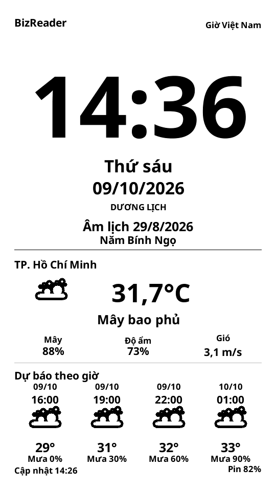

# Giao diện dọc ngày 09/10/2026

## Bố cục

- Khổ dọc 540 × 960, giữ lề an toàn 28 px trên LilyGo T5-4.7-S3 V2.4 N16R8.
- Nửa trên: giờ HH:MM lớn, thứ, ngày/tháng/năm dương lịch, ngày/tháng/năm âm lịch
  và tên năm can chi. Tháng nhuận, mùng một và ngày rằm có nhãn riêng.
- Giữa: địa điểm, nhiệt độ °C, mô tả và biểu tượng thời tiết, phần trăm mây,
  độ ẩm và tốc độ gió m/s.
- Dưới: bốn mốc dự báo sắp tới, gồm ngày, giờ, biểu tượng, nhiệt độ và khả năng mưa.
  Dữ liệu OpenWeather hiện dùng các mốc cách nhau ba giờ.
- Bỏ lịch tháng. Khi chưa có giờ hợp lệ, hiển thị dấu chờ thay cho ngày giả.

## Build và kiểm thử

- Build `hcm_weather` thành công trên PlatformIO `espressif32@6.4.0`, Arduino 2.0.11.
- RAM tĩnh: 53.264 byte; chương trình: 1.185.569 byte; firmware.bin: 1.187.968 byte.
- SHA256 firmware: `6be67e571ebf88ea0d565a13541592bbfdf95ad5e3b838ce8f7b26fa25de0865`.
- SHA256 bản vá: `be8819035e8b9656fa7521ffe7e2c0325eaa2cd724b6b07fc68cc2800f30e42d`.
- 37/37 trường hợp giao diện qua ASan/UBSan: các biểu tượng ngày/đêm, dữ liệu cũ,
  lỗi mạng, địa danh dài, nhiệt độ âm, Tết, rằm, tháng âm nhuận, giao năm và giờ chưa hợp lệ.
- 18/18 trường hợp biểu tượng của trình xem trước cũ vẫn chạy được.
- Bản vá áp dụng sạch trên commit LilyGo nền; 42 tệp trong manifest đã được đối chiếu
  với nguồn dùng để build. Bộ kiểm tra lưu cache vẫn qua năm tình huống lỗi đọc lại.
- Kiểm tra toàn bộ 518.400 tọa độ xoay; 87.120 pixel vùng giờ và byte bảo vệ khi cắt vùng.
- Khi đổi phút, chỉ vẽ lại vùng giờ: tọa độ dọc `(28, 112, 484, 180)`, tương ứng
  tọa độ vật lý `(112, 28, 180, 484)`. Ngày mới, thời tiết mới hoặc thay đổi trạng thái
  vẫn làm mới toàn màn hình theo logic hiện có.
- Font tiếng Việt và font đồng hồ được lưu sẵn trong bản vá; font giờ chỉ chứa 12 ký tự.
  Bộ đệm chữ xoay dùng thêm 259.200 byte PSRAM; ảnh cắt vùng giờ dùng 43.560 byte PSRAM.

## Trạng thái thiết bị

**Chưa nạp bản dọc:** lúc kiểm tra, Mac không thấy cổng USB của máy đọc sách.
Các ảnh và kiểm thử trên đây được dựng từ nguồn, chưa xác nhận chất lượng làm mới,
chiều đặt máy, thời gian thức hoặc pin của bản dọc trên phần cứng.

Biên bản [04/10/2026](VERIFICATION.md) ghi nhận bản ngang trước đây. Thời gian thức
1,2 giây của bản ngang không được dùng làm số đo cho bản dọc vì vùng giờ nay lớn hơn.

Nạp riêng ứng dụng tại `0x10000` theo [hướng dẫn](README.md), giữ cấu hình Wi-Fi/API
trong SPIFFS. Tệp cấu hình và bản sao flash riêng không nằm trong gói nguồn công khai.
